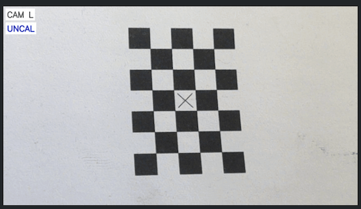
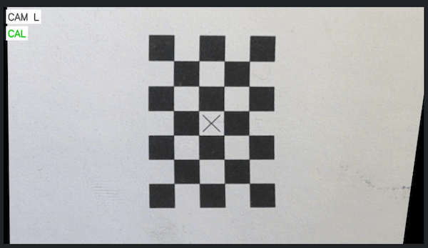
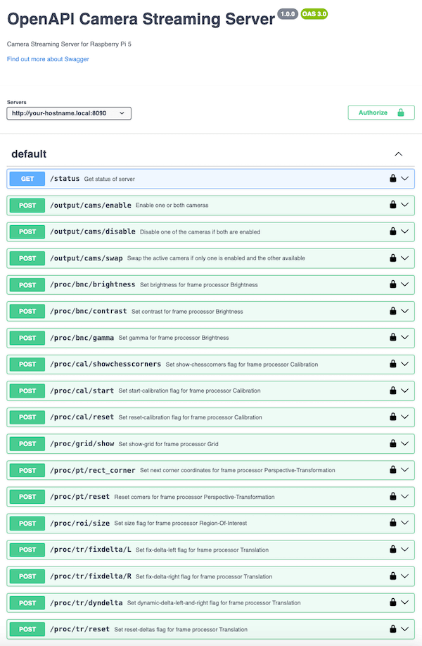

# Camera Streaming Server for Raspberry Pi 5

Minimalistic multithreaded server that provides a MJPEG stream via HTTP and also
a REST API for controlling the server.

Under the hood it uses

- Raspberry's version of [libcamera](https://github.com/raspberrypi/libcamera) through a GStreamer pipeline for acquiring the camera images
- [OpenCV](https://github.com/opencv/opencv) for adjusting the camera images

Features:

- support for one and two cameras
- support for multiple simultaneous HTTP and streaming clients
- various camera image adjustments:
  - calibration (using a chessboard pattern to find four corners of a rectangle)
  - perspective transformation (using the calibration data the image will be adjusted in order to remove distortions)
  - region of interest (removes parts of the image that are blank due to perspective transformation)
  - translation (moves the image in the X- or Y-direction)
  - horizontal and/or vertical image flipping
  - scaling (scales the output image to a fixed resolution)
  - brightness and contrast
  - grid overlay
  - text overlay
- support for GStreamer and external MJPEG streams as input source for the camera image(s)
- support for adaptive FPS setting (will reduce the frames per second setting of the GStreamer input if necessary)
- REST API to control all settings

The software has been tested with:

- Raspberry Pi 5
- with two Raspberry Camera Module v3 (IMX708) cameras
- on Debian Bookworm 12.9

## Prerequisites

A custom build of OpenCV is required:

```
$ cd build_opencv/4.11.0
$ ./build-opencv-rpi.sh
```

Or if you want to test the software on another computer you can use `./build-opencv-client.sh` instead.

On Linux this will install all dependencies, build OpenCV with appropriate flags and install it.  
On macOS this will only install the dependency ffmpeg and build OpenCV but not install OpenCV into the system.

The dependencies on Linux notably include

- GStreamer (for `build-opencv-rpi.sh` and `build-opencv-client.sh`)
- libcamera (on `build-opencv-rpi.sh` only)

The dependencies on macOS notably include

- ffmpeg (for `build-opencv-client.sh`)

**Note:** Support for macOS is limited to being able to compile the application. But it most likely won't actually work.

## Configuration

There are two example configuration files:

- `config-example-gstreamer.json`: uses GStreamer as input for the camera image stream(s)
- `config-example-mjpeg.json`: uses external MJPEG stream(s) as input for the camera image stream(s)

The `config-example-mjpeg.json` is intended for testing the server on a computer that doesn't have the camera(s) attached to it.  
And `config-example-gstreamer.json` is intended for using on the Raspberry Pi.

Choose one of them and copy it to `config.json` in the project's root directory.  
Then you can edit the file and adjust the settings as required or desired.

## Compiling and Running the Server

Simply run the following commands:

```
$ ./comp.sh
$ ./run.sh
```

## Calibrating the Camera Image

Camera calibration requires printing out the PDF `generate_pattern/pattern-chessboard-inner_04x06_05mm-crosshair.pdf`  
and placing it in front of the camera to be calibrated.  
After a POST request (which needs to include the API key) to `http://<HOSTNAME_OR_IP>:8090/proc/cal/start`
the calibration process will begin. See [REST API](#rest-api) for more details.

The frame processors "perspective transformation" and "translation" require the camera image to be calibrated first.

Camera calibration assumes that the camera is mounted stationary and the plane it is looking at will also remain
constant in its relation to the camera's axis. The distance between the plane and the camera may vary though.  
The calibration and the subsequent automatic perspective transformation will then attempt
to straighten out the camera image.

**Screenshot of an uncalibrated camera image:**  


**Screenshot of a calibrated camera image:**  


## Accessing the HTTP Server and MJPEG Stream

The HTTP server will provide a very basic HTML page that displays the MJPEG stream.  
Per default the port is 8090, but it can be adjusted in the `config.json`.

HTML page: `http://<HOSTNAME_OR_IP>:8090/`  
MJPEG stream: `http://<HOSTNAME_OR_IP>:8090/stream.mjpeg`

## REST API

All requests require the header `apikey` (or `X-Api-Key`) for authorization.  
The value of the API key can be set in the `config.json` file.  
But the value of the API key must not be transmitted in plain text, but instead in the form of a hashsum that
has been derived from the value in a specific way.  
To make it easy to find that hashsum, the application will output something like this at startup:

```
CFG: API Key Hash for 'DEFAULT' = 'fcab525e507275f17fbaf7932048beba'
```

In this example the value `fcab525e507275f17fbaf7932048beba` is the hashsum of the API key value `xylophon` from
the example config files.

To poll the status of the server with *curl* you could run the following:

```
$ curl -X GET 'http://<HOSTNAME_OR_IP>:8090/status' -H 'accept: application/json' -H 'X-Api-Key: fcab525e507275f17fbaf7932048beba'
```

Full OpenAPI specification of the API can be found here: [docs/api-camera_server.yaml](docs/api-camera_server.yaml).  
There are many ways of using the specification, but a good starting point would be to load the file into [https://editor.swagger.io/](https://editor.swagger.io/).

**Screenshot of Swagger Editor:**  

